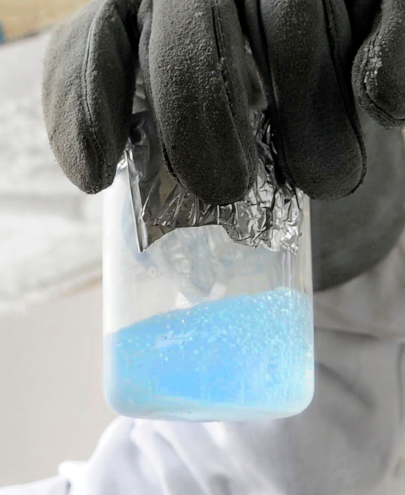

> From [Wikipedia](https://en.wikipedia.org/wiki/Oxygen)

__Oxygen__ is the chemical element with the symbol __O__ and atomic number 8. It is a member of the chalcogen group in the periodic table, a highly reactive nonmetal, and an oxidizing agent that readily forms oxides with most elements as well as with other compounds. By mass, oxygen is the third-most abundant element in the universe, after hydrogen and helium. At standard temperature and pressure, two atoms of the element bind to form dioxygen, a colorless and odorless diatomic gas with the formula O2. Diatomic oxygen gas constitutes 20.8% of the Earth's atmosphere. As compounds including oxides, the element makes up almost half of the Earth's crust.

Dioxygen is used in cellular respiration and many major classes of organic molecules in living organisms contain oxygen, such as proteins, nucleic acids, carbohydrates, and fats, as do the major constituent inorganic compounds of animal shells, teeth, and bone. Most of the mass of living organisms is oxygen as a component of water, the major constituent of lifeforms. Oxygen is continuously replenished in Earth's atmosphere by photosynthesis, which uses the energy of sunlight to produce oxygen from water and carbon dioxide. Oxygen is too chemically reactive to remain a free element in air without being continuously replenished by the photosynthetic action of living organisms. Another form (allotrope) of oxygen, ozone (O3), strongly absorbs ultraviolet UVB radiation and the high-altitude ozone layer helps protect the biosphere from ultraviolet radiation. However, ozone present at the surface is a byproduct of smog and thus a pollutant.

Oxygen was isolated by Michael Sendivogius before 1604, but it is commonly believed that the element was discovered independently by Carl Wilhelm Scheele, in Uppsala, in 1773 or earlier, and Joseph Priestley in Wiltshire, in 1774. Priority is often given for Priestley because his work was published first. Priestley, however, called oxygen "dephlogisticated air", and did not recognize it as a chemical element. The name oxygen was coined in 1777 by Antoine Lavoisier, who first recognized oxygen as a chemical element and correctly characterized the role it plays in combustion.

Common uses of oxygen include production of steel, plastics and textiles, brazing, welding and cutting of steels and other metals, rocket propellant, oxygen therapy, and life support systems in aircraft, submarines, spaceflight and diving.
