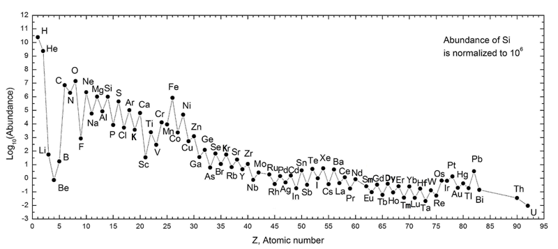

> De: https://es.wikipedia.org/wiki/Elemento_qu%C3%ADmico

Un __elemento químico__ es un tipo de materia constituida por átomos de la misma clase.[^Urdiales, Blanca Alma Valdivia; Granillo, María del Pilar; Dominguez, María del Socorro Villareal (2000). Biología General: Los sistemas vivientes. Grupo Editorial Patria. ISBN 9786077440604. Consultado el 9 de febrero de 2018.] En su forma más simple, posee un número determinado de protones en su núcleo, haciéndolo pertenecer a una categoría única clasificada con el número atómico, aun cuando este pueda desplegar [distintas masas atómicas](./radionuclides).

Es un átomo con características físicas únicas, aquella sustancia que no puede ser descompuesta mediante una reacción química, en otras más simples. Pueden existir dos átomos de un mismo elemento con características distintas y, en el caso de que estos posean número másico distinto, pertenecen al mismo elemento pero en lo que se conoce como uno de sus isótopos. También es importante diferenciar entre los «elementos químicos» de una sustancia simple. Los elementos se encuentran en la [tabla periódica de los elementos](../periodic-table).

El ozono (O3) y el dioxígeno (O2) son dos sustancias simples, cada una de ellas con propiedades diferentes. Y el elemento químico que forma estas dos sustancias simples es el oxígeno (O).

Algunos elementos se han encontrado en la naturaleza y otros obtenidos de manera artificial, formando parte de sustancias simples o de compuestos químicos. Otros han sido creados artificialmente en los aceleradores de partículas o en reactores atómicos. Estos últimos suelen ser inestables y solo existen durante milésimas de segundo. A lo largo de la historia del universo se han ido generando la variedad de elementos químicos a partir de nucleosíntesis en varios procesos, fundamentalmente debidos a estrellas.

Los nombres de los elementos químicos son nombres comunes y como tales deben escribirse sin mayúscula inicial, salvo que otra regla ortográfica lo imponga.

## Elementos químicos y número atómico

Un elemento químico es una sustancia pura formada por átomos que tienen el mismo número atómico, es decir, el mismo número de protones. Cada elemento se distingue de los demás por sus propiedades características. Se denomina número atómico al número de protones que tiene el núcleo de un átomo. Este número es igual al número de electrones que el átomo neutro posee alrededor del núcleo.

